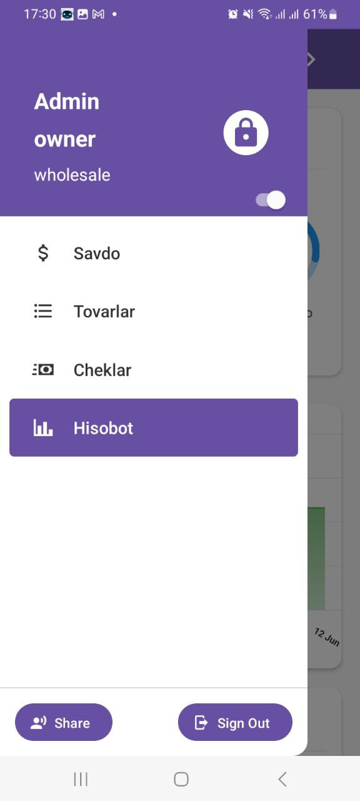
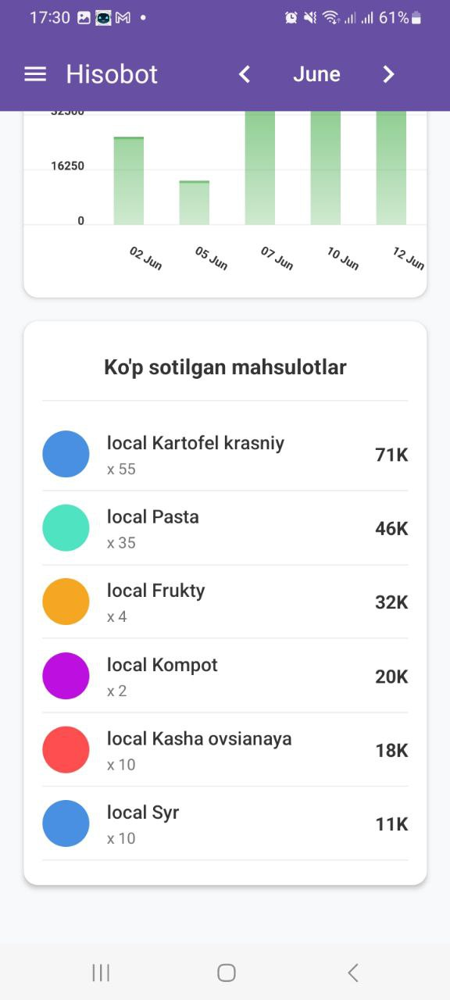
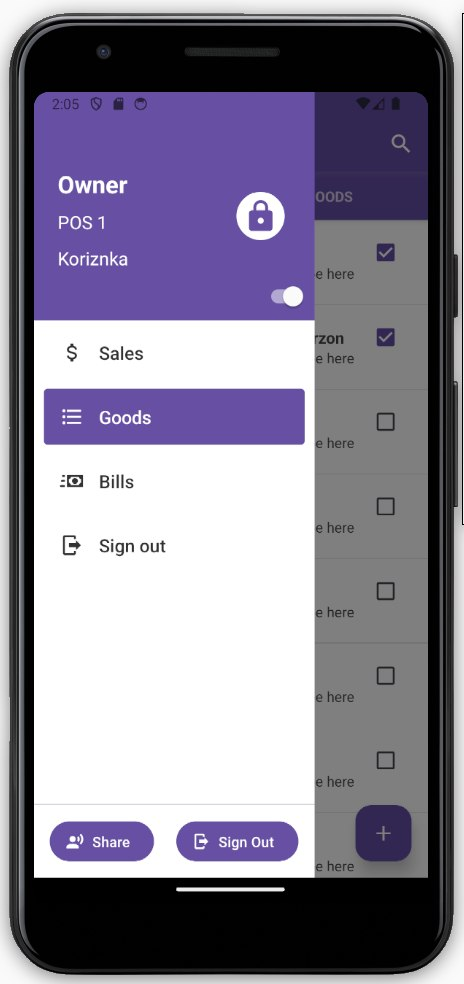
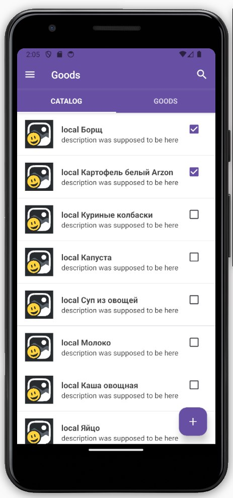
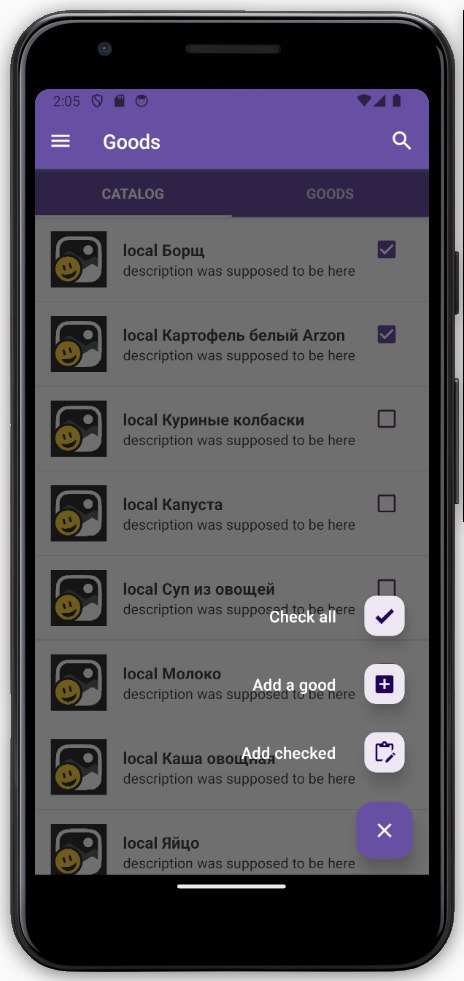
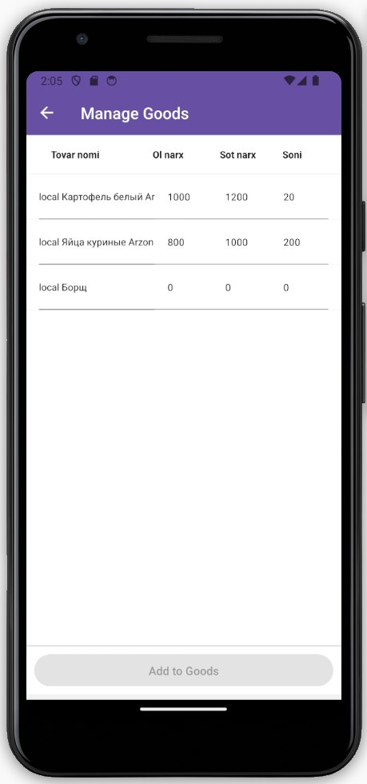

## Project Files

- **Android APK:**  
  [`ollio.v1.0.4.apk`](./demo/ollio.v1.0.4.apk)

- **Photos:**  
  <table>
    <tr>
      <td></td>
      <td></td>
      <td></td>
    </tr>
    <tr>
      <td></td>
      <td></td>
      <td></td>
    </tr>
    <tr>
      <td></td>
      <td></td>
      <td></td>
    </tr>
  </table>

- **Video:**  
  [video_2025-08-11_11-28-55.mp4](./demo/video_2025-08-11_11-28-55.mp4)
  Ignore the speech in the video