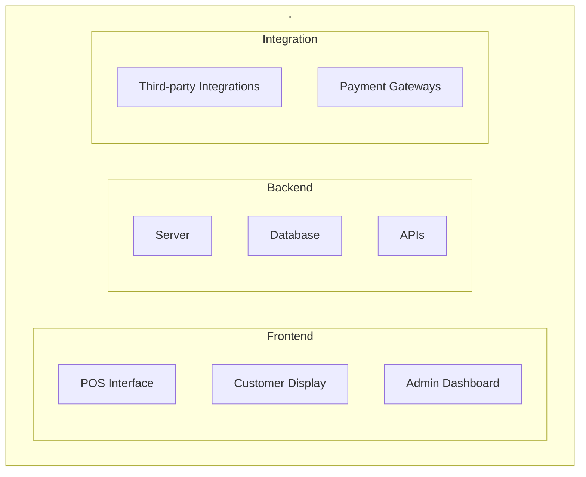
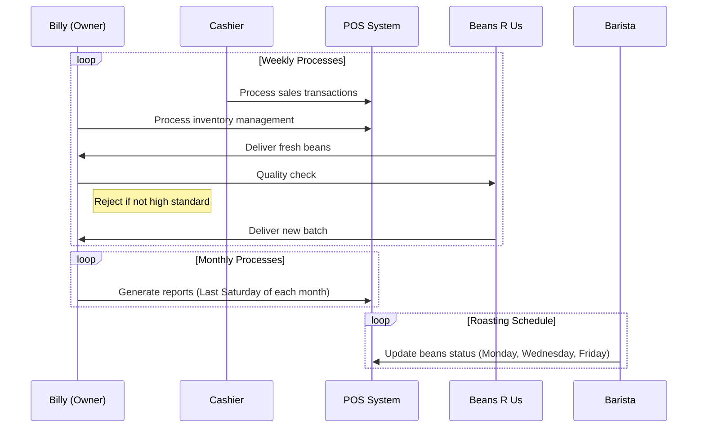
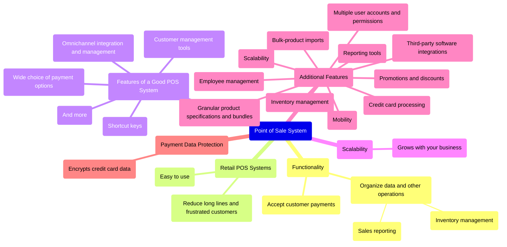
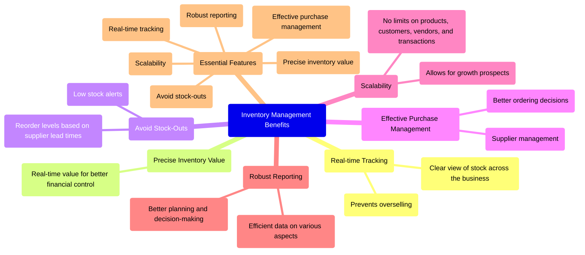

## How to generate apk file

1. [How To Generate apk Using React Native Expo CLI](https://medium.com/@hrusikesh251.nalanda/how-to-generate-apk-using-react-native-expo-cli-43c4c2085636)

##### OR

1. https://docs.expo.dev/build/setup/
2. https://docs.expo.dev/build-reference/apk/

## Key Features of a Point of Sale System

#### Billing and Order Processing

- **Scan Items for Billing**: Automatically capture item details and prices.
- **Generate Invoices**: Create detailed invoices for each transaction.
- **Add Discounts**: Offer promotional discounts directly within the POS system.
- **Customer Details**: Include customer information such as name, address, and contact details.
- **Additional Remarks**: Note any specific instructions or special requests.

#### Inventory Tracking

- **Monitor Inventory Counts**: Keep track of individual SKUs and overall stock levels.
- **Digital Stock Counting**: Use digital methods to count stock, saving time and money.
- **Low Stock Notifications**: Receive alerts when stock levels reach a predefined threshold.
- **Reordering Automation**: Automatically place orders with vendors based on low stock and lead time.

#### Customer Data Management

- **Customer Loyalty Program**: Implement a rewards system to encourage repeat purchases.
- **Survey and Feedback**: Share customer satisfaction surveys and act on feedback.
- **Customer Relationship Management (CRM)**: Build and maintain relationships with customers.

#### Automated Purchasing

- **Vendor Ordering**: Automatically place orders with vendors based on stock levels and lead times.
- **Prevent Stockouts**: Ensure sufficient inventory to avoid lost sales.
- **Reduce Holding Costs**: Save on storage costs by ordering only what is needed.

#### Multi-location Capabilities

- **Unified Catalog Management**: Manage inventory across multiple locations from a single dashboard.
- **Inventory Transfer**: Transfer products between locations as needed.
- **Loyalty Program Management**: Run loyalty programs across all stores.
- **Role-Based Access**: Control access to prevent unauthorized actions.

#### Payment Card Industry (PCI) Agreement

- **Compliance**: Ensure the POS system complies with PCI DSS standards.
- **Risk Management**: Protect against fraud and unauthorized transactions.
- **Security Measures**: Implement security features like encryption and multi-factor authentication.

#### Reporting Tools

- **Real-time Reporting**: Monitor sales and store performance in real-time.
- **Custom Reports**: Generate reports tailored to your business needs.
- **Employee Productivity Tracking**: Monitor and reward employee performance.

#### Digital Signage

- **Advertisements and Promotions**: Display ads and promotional messages to customers.
- **Enterprise-Wide Messaging**: Send messages to customers across all locations.
- **Targeted Advertising**: Showcase products or deals to specific audiences.

#### Shipping Integration

- **Real-time Quotes**: Get immediate shipping quotes from carriers.
- **Shipping Labels**: Print shipping labels and tracking details directly from the POS system.
- **Customer Receipts**: Include shipping details on customer receipts.

#### Mobile Payment on Site

- **Fast Checkout**: Enable customers to scan a QR code for quick payments.
- **Reduced Wait Times**: Speed up the checkout process for a better customer experience.
- **Increased Profitability**: Save time and increase sales by reducing wait times.

#### Employee Management

- **Employee Accounts**: Create and manage accounts for each employee.
- **Sales Tracking**: Monitor each employee's sales record.
- **Goal Setting**: Assign goals and track progress towards achieving them.
- **Password Protection**: Secure employee accounts with strong passwords.

#### Easy Installation and Integration Capabilities

- **Intuitive Interface**: Ensure the POS system is user-friendly.
- **Third-Party Integration**: Seamlessly integrate with other business tools like eCommerce and accounting software.
- **Non-Tech-Savvy Operation**: Make the system accessible even for non-tech-savvy users.

#### Return and Refund Policy Feature

- **Shopper-Friendly Returns**: Allow customers to return items within a specified timeframe.
- **Refund Options**: Offer store credits or direct bank refunds for returned items.
- **Enhanced Customer Satisfaction**: Improve customer satisfaction by providing flexible return policies.

#### Product Variant and Composites

- **Single Product Links**: Display all product variants under a single product link.
- **Composite Items**: Combine products for promotional offers, simplifying pricing and discounts.
- **Promotion Management**: Easily run promotions without manual updates.

#### Bulk Stock Imports

- **Efficient Stock Updates**: Import stock updates in bulk, saving time and reducing errors.
- **Seasonal Sales Management**: Easily manage stock levels for sale seasons.
- **Sale Preparation**: Update product information and prices for upcoming sales events.

#### Customer-Facing Display

- **Transparency**: Provide customers with a clear view of their order before finalizing it.
- **Error Correction**: Allow customers to correct mistakes before the bill is generated.
- **Enhanced Customer Experience**: Improve the shopping experience by making the order process more transparent.

#### Loyalty Programs

- **Customer Retention**: Implement loyalty programs to encourage repeat business.
- **Rewards and Discounts**: Offer rewards and discounts based on customer purchase history.
- **Integration with Third-Party Services**: Compatibility with external loyalty program providers.

#### Barcodes

- **Inventory Management**: Use barcodes for efficient inventory tracking and management.
- **Product Identification**: Ensure each product can be easily identified and tracked.
- **Sales Processing**: Speed up the sales process by scanning barcodes.

#### Promotions

- **Easy Promotion Management**: Simplify the process of running promotions and discounts.
- **Automated Updates**: Update product prices and promotional information without manual changes.
- **Customer Engagement**: Attract customers with limited-time promotions and deals.

## [POS System Features Checklist](https://www.selecthub.com/pos/pos-system-features/)

### 1. Inventory Management

- **Inventory Tracking**
  - Real-time inventory updates
  - Adjust inventory counts
  - Set low stock alerts
- **Inventory Forecasting**
  - Predict sales trends
  - Optimize stock levels
  - Avoid stockouts
- **Barcode Scanning**
  - Quickly input product information
  - Increase sales speed
  - Reduce errors

### 2. Customer Relationship Management (CRM)

- **Customer Profiles**
  - Store customer information
  - Personalize shopping experience
  - Send personalized promotions
- **Loyalty Programs**
  - Reward repeat customers
  - Increase customer loyalty
  - Boost sales through rewards
- **Customer Communication**
  - Send promotional emails
  - Manage customer feedback
  - Improve customer service

### 3. Sales Processing

- **Multiple Payment Options**
  - Accept cash, credit, debit, and mobile payments
  - Integrate with payment gateways
  - Process payments offline
- **Tax Calculation**
  - Automatically calculate sales tax
  - Adjust tax rates as needed
  - Ensure accurate tax reporting
- **Sales Reports**
  - Generate detailed sales reports
  - Analyze sales trends
  - Identify best-selling products

### 4. Employee Management

- **Employee Scheduling**
  - Create and manage employee schedules
  - Automate shift scheduling
  - Ensure adequate staffing
- **Performance Tracking**
  - Monitor employee sales and performance
  - Set sales goals and track progress
  - Reward top performers
- **Access Control**
  - Set user permissions
  - Protect sensitive data
  - Ensure security

### 5. Integration Capabilities

- **E-commerce Integration**
  - Sync online and in-store sales
  - Manage inventory across channels
  - Enhance customer experience
- **Accounting Integration**
  - Automate financial reporting
  - Integrate with accounting software
  - Streamline financial processes
- **Inventory Management Integration**
  - Sync inventory levels across POS and warehouse systems
  - Automate order fulfillment
  - Improve order accuracy

### 6. Support and Training

- **Customer Support**
  - Access 24/7 customer support
  - Get help with setup and troubleshooting
- **Training Materials**
  - Access training materials and tutorials
  - Learn how to use the POS system effectively
- **Documentation**
  - Comprehensive user manuals
  - FAQs and troubleshooting guides
  - Technical support resources

### 7. Additional Features

- **Point of Sale Hardware**
  - Receipt printers
  - Barcode scanners
  - Cash drawers
- **Mobile POS**
  - Use smartphones or tablets as POS devices
  - Access POS functions from anywhere
- **Reporting and Analytics**
  - Detailed sales analytics
  - Customizable dashboards
  - Data-driven insights

vscode extension: markdown preview mermaid support

## POS System High Level Architecture

## Sequence Diagrams: Replenishing coffee beans for a coffee shop

## [15 Essential POS System Features](https://www.business.com/articles/essential-pos-features-retail-business/)

## Inventory Management Software Features

